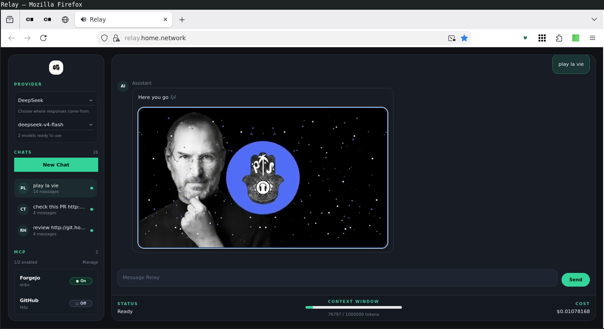

## About

Relay is a production-style, self-hostable LLM environment built on
[llm.rb](https://github.com/llmrb/llm.rb#readme). It is both a usable
workspace and a reference implementation: a real product that shows how
llm.rb can power providers, tools, MCP servers, attachments, saved
contexts, and streaming conversations in one application.

## Screenshot



## Built with llm.rb

Relay is meant to show what llm.rb can power in a real application:

- multi-provider conversational products
- persistent contexts and long-lived sessions
- built-in tools and MCP-backed capabilities
- streaming interfaces
- cost and context-window visibility

#### From runtime to product

| llm.rb capability | How Relay uses it |
| --- | --- |
| `LLM::Context` | Saved conversations and long-lived chat sessions |
| Provider abstraction | Provider and model switching in the UI |
| Tools runtime | Built-in tools and local tool execution |
| MCP integration | External capability and server integration |
| Streaming/context execution | Live streamed responses over the chat UI |
| Cost and context tracking | Sidebar and status indicators for usage and context budget |

#### Why Relay matters

Relay demonstrates that llm.rb can support:

- multi-provider conversational applications
- persistent session and context management
- user-visible tools and MCP servers
- streaming user interfaces
- long-context workflows
- operational features like cost and context-window tracking

## Why use Relay

Relay is a good fit if you want to:

- use a self-hosted workspace for multi-provider LLM work
- connect models to local tools and MCP servers
- keep long-lived conversations with saved contexts
- compare providers and models in one interface
- fork a real application as the base for your own llm.rb product

## Quick start

If you just want Relay running locally, this is the shortest path.

**Requirements**

- Ruby
- Node.js
- Webpack
- SQLite

**1. Install dependencies**

```sh
bundle install
```

**2. Configure secrets**

Create `~/.relay/env`:

```sh
OPENAI_SECRET=...
GOOGLE_SECRET=...
ANTHROPIC_SECRET=...
DEEPSEEK_SECRET=...
XAI_SECRET=...
SESSION_SECRET=...
REDIS_URL=
```

You only need provider secrets for the providers you plan to use.

**3. Set up the database**

```sh
bundle exec rake db:setup
bundle exec rake db:seed
```

The seed creates a default local user:

- email: `0x1eef@hardenedbsd.org`
- password: `relay`

Change the seeded values in [db/seeds.rb](./db/seeds.rb) first if you
do not want those defaults.

**4. Start Relay**

```sh
bundle exec rake dev:start
```

Then open Relay in your browser and sign in with the seeded account.

During development, Relay enables Zeitwerk reloading and refreshes
autoloaded constants between requests, so changes under `app/` are
picked up without restarting the web server.

When packaged as a gem, Relay ships its compiled frontend assets in
`public/`, so running `relay start` does not require a local webpack
build. Webpack remains a development tool for working on the frontend.
Runtime state lives under `~/.relay/` by default, including the env
file, SQLite databases, logs, uploads, generated images, and jukebox
data.

## Features

### Workspace

- Streaming chat over WebSockets with server-rendered updates
- Multiple provider support: OpenAI, Google, Anthropic, DeepSeek, and xAI
- Saved chat contexts with provider-aware switching and new-context creation
- Attachment support for providers that accept local files through
  `llm.rb`
- Built-in tool support plus automatic loading of custom tools from [app/tools/](app/tools)
- User-managed MCP server integration from the Relay web UI
- Session-backed sign-in and per-user persistent context
- A jukebox sidebar with tool-driven playlist management

### Platform

- Rack application built with Falcon, Roda, and async-websocket
- Sequel models and migrations for application state
- Sidekiq workers for background jobs
- A built-in task monitor for the local development stack: web, workers, and assets
- Session support through Roda's session plugin
- In-memory shared state via `Relay.cache`
- Automatic `.env` loading during boot
- Zeitwerk hot reloading in development

## For builders

Relay is both a usable product and a reference implementation. If you
want the internal layout, routing model, concerns, boot sequence, and
test structure, see [resources/architecture.md](./resources/architecture.md).

## Customization

**Tools**

Relay ships with built-in tools in [`app/tools/`](app/tools):

- [`create_image.rb`](./app/tools/create_image.rb) generates images
- [`relay_knowledge.rb`](./app/tools/relay_knowledge.rb) exposes project documentation
- [`juke_box.rb`](./app/tools/juke_box.rb) reads from the built-in playlist
- [`add_song.rb`](./app/tools/add_song.rb) adds songs to the jukebox playlist
- [`remove_song.rb`](./app/tools/remove_song.rb) removes songs from the jukebox playlist
- [`apropos.rb`](./app/tools/apropos.rb) searches FreeBSD man pages with `apropos`

These tools serve as examples of how to extend Relay's behavior. They
show common patterns such as calling external providers, editing local
application data, returning documentation-backed knowledge, invoking
system commands, and rendering structured tool output in the interface.

To add your own behavior, create additional tools under `app/tools/`.
Relay loads registered tools automatically, so new tools become
available to the model alongside the built-in ones.

**MCP**

Relay includes an MCP management page so each user can configure their
own stdio MCP servers from the web UI.

This first version keeps the setup intentionally small:

- `name` and `description` for display
- `argv` for the command to launch
- optional `cwd`
- optional `env` entries as `KEY=value`
- an `enabled` flag to control whether the server is active in chat

To add a server, install the MCP binary you want to run, open the MCP
management page in Relay, and save the stdio launch configuration there.

Once configured, Relay starts the MCP servers for the chat session and
adds their tools to the available tool list.

## Sources

* [GitHub.com](https://github.com/llmrb/relay)
* [GitLab.com](https://gitlab.com/llmrb/relay)
* [Codeberg.org](https://codeberg.org/llmrb/relay)

## License

[BSD Zero Clause](https://choosealicense.com/licenses/0bsd/)
<br>
See [LICENSE](./LICENSE)
